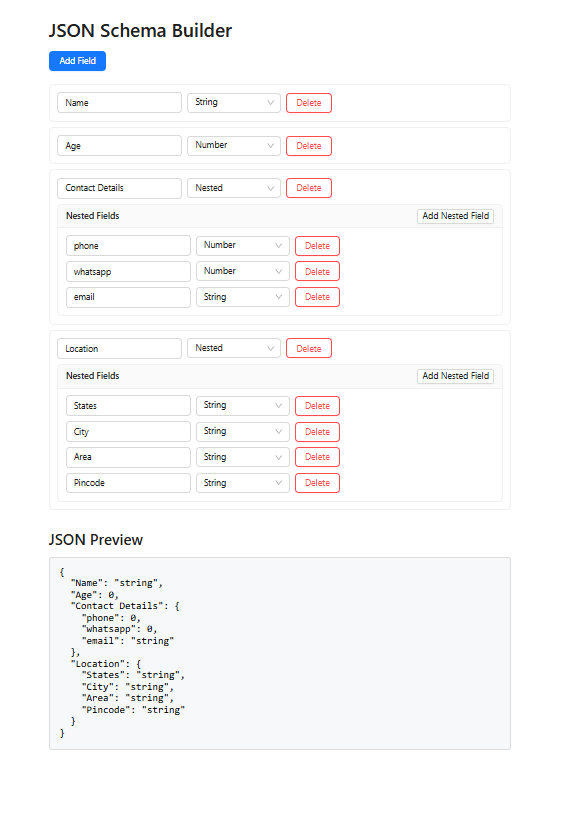

# **[JSON Schema Builder](https://hroneassignment.netlify.app/)**
## Overview
This is a **JSON Schema Builder** web app built using **React** and **Ant Design (AntD)**. The app allows users to dynamically create and preview JSON structures with support for nested fields and multiple data types.

## Features
- ➕ **Add and delete fields** dynamically.
- 🔑 **Specify field name and type** (`string`, `number`, `float`, `boolean`, `objectId`, `nested`).
- 🧱 **Nested objects** support with recursive field generation.
- 🔁 **Real-time JSON output** generation.
- 🧪 **Live preview** of the schema structure in formatted JSON.

## Screenshot


## Technologies Used
- **React** (for component-based UI)
- **Ant Design** (for elegant and interactive components)
- **JavaScript (ES6+)** (logic and dynamic rendering)
- **CSS** (minimal custom styling)

## Installation
### Prerequisites
Make sure you have **Node.js** and **npm** installed.

### Steps to Run
1. Clone the repository:
   ```bash
   git clone https://github.com/yourusername/json-schema-builder.git
````

2. Navigate to the project folder:

   ```bash
   cd json-schema-builder
   ```
3. Install dependencies:

   ```bash
   npm install
   ```
4. Start the development server:

   ```bash
   npm start
   ```
5. Open `http://localhost:3000/` in your browser.


## Folder Structure

```
src/
├── App.js          # Main application logic
├── Field.js        # Reusable recursive Field component
├── App.css         # Custom CSS styles
└── index.js        # ReactDOM entry point
```


